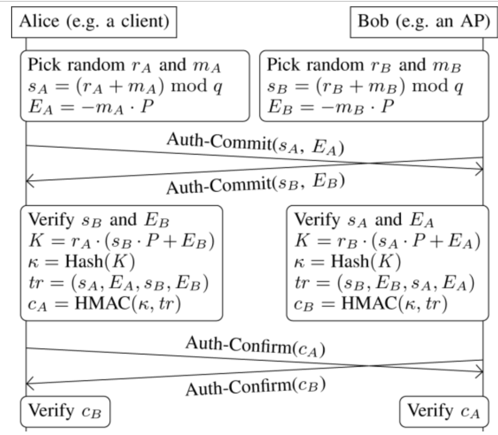

> Link to article: https://ieeexplore.ieee.org/document/9152782

## RADIUS w kontekście WPA3 Enterprise:

1. **Client** łączy się z AP (ex. SSID =  WPA3-Enterprise).
2. AP mówi: *“ok, authenticate via 802.1X/EAP”*.
3. Client zaczyna EAP (np. **EAP-TLS**, **EAP-PEAP**, **EAP-pwd**).
4. AP **forwarduje** te pakiety do **RADIUS servera**.
5. RADIUS **sprawdza dane** (cert, login, hasło itd.) i wysyła do AP:

   * `Access-Accept` → user ok,
   * `Access-Reject` → odrzucony.
6. Po `Access-Accept` AP i client robią **4-way handshake** → generują sesyjny key i szyfrują ruch.

#### Realnie:

* WPA3 definiuje **szyfrowanie i handshake**.
* 802.1X/EAP definiuje **auth flow**.
* RADIUS to **backend**, który faktycznie sprawdza userów.
* Każdy user dostaje **indywidualny klucz sesji** – nie ma wspólnego PSK jak w WPA2.

tldr:
WPA3-Enterprise = WPA3 security layer + 802.1X/EAP + RADIUS auth.
AP tylko pośredniczy, RADIUS robi auth, WPA3 ogarnia szyfrowanie.

## Dragonfly / SAE / EAP-pwd – po krotce o co chodzi

**Dragonfly** to PAKE (Password Authenticated Key Exchange), zaprojektowany przez Harkinsa (2008).
Używany w **WPA3 (SAE)** i **EAP-pwd** (Enterprise).
Cel → uniknięcie **offline dictionary attacks** i zapewnienie **forward secrecy** (każda sesja ma unikalny klucz, nawet jeśli hasło jest to samo).

---

### Password → Group element

Zanim handshake się zacznie, hasło jest zamieniane w element grupy (punkt na krzywej eliptycznej lub liczba mod p):

* Dla ECC: metoda **hash-to-curve**,
* Dla FFC: metoda **hash-to-group**.

Algorytm działa metodą **try-and-increment**:

1. Hash z: hasła + countera + IDs obu peerów (MAC adresy / ID serwera itp.),
2. Wynik próbuje być x-koordinatem punktu,
3. Jeśli istnieje y dla tej krzywej (czyli punkt leży na krzywej), mamy **P (password element)**,
4. Jeśli nie, inkrementujemy counter i próbujemy dalej.

W **EAP-pwd** do inputu hasha dodaje się też **random token** od serwera.

---

### Timing leaks i mitigacje
Autorzy zwracają uwagę, że:

* WPA3-SAE robi pętlę **k razy** niezależnie, kiedy znajdzie P, żeby uniknąć **timing leaks** (typowo k=40).
* EAP-pwd **nie ma tej obrony**.
* Problemem może być też sprawdzanie, czy istnieje rozwiązanie dla y → może zdradzić info przez różnice w czasie.

  * WPA3 zaleca użycie **Legendre function** do sprawdzenia,
  * Ale nawet ona może leakować → 802.11 rekomenduje **QR blinding** (randomize + square + multiply z residue).

**Podkreślony punkt**: EAP-pwd jest bardziej podatny na leak timingowy, WPA3 ma zalecenia jak tego uniknąć.

---

Ok, rozpiszmy **Dragonfly / SAE Commit Phase w WPA3-Personal** dokładnie, krok po kroku, z wyjaśnieniem wszystkich symboli i wartości. Będziemy trzymać się implementacji w ECC (eliptyczne krzywe), bo to najczęściej używane w WPA3.

---

## Przygotowanie do handshaku

### a) Parametry grupy

* `G` → generator grupy eliptycznej (punkt na krzywej)
* `q` → rząd grupy (liczba elementów w cyklu generowanym przez G)
* `O` → punkt w nieskończoności (neutralny)
* Operacje: dodawanie punktów i mnożenie skalarne modulo `q`

> W skrócie: wszystkie punkty i operacje są w obrębie tej grupy, a bezpieczeństwo opiera się na **Elliptic Curve Discrete Logarithm Problem** (ECDLP).

---

### b) Password → Password Element `P`

1. Hasło użytkownika (`password`) + MAC klienta + MAC AP → funkcja hash → `x-coordinate`
2. Sprawdza się, czy istnieje `y` takie, że `(x, y)` leży na krzywej eliptycznej `y² = x³ + ax + b mod p`.
3. Jeśli tak → `P = (x, y)`
4. Jeśli nie → inkrementacja countera, hash ponownie, aż znajdzie się poprawny punkt.

> `P` jest teraz punktem na krzywej, który zależy od hasła i identyfikatorów peerów → **unikalny dla tej sesji**.

---

### c) Losowe liczby

Każda strona losuje dwa skalary:

* `r_i` ∈ [2, q-1]
* `m_i` ∈ [2, q-1]
* Warunek: `r_i + m_i ∈ [2, q-1]`

Te liczby są **tajne**, używane do wygenerowania punktów wymienianych w commit.

---

## Obliczanie punktów commit

Dla laptopa (client):

1. `E₁ = - m₁ * P` → punkt odjęty (negacja) przemnożony przez `m₁`
2. `s₁ = r₁ + m₁` → suma skalarów
3. Commit frame będzie zawierał `(s₁, E₁)`

Dla AP:

1. Losuje `r₂, m₂`
2. Oblicza `E₂ = - m₂ * P`, `s₂ = r₂ + m₂`
3. Wysyła **SAE Commit frame** `(s₂, E₂)` do laptopa

---

### d) Weryfikacja odbiorcy

Po odebraniu commit frame każda strona sprawdza:

1. `1 ≤ s_i ≤ q-1`
2. `E_i` jest punktem na krzywej (ECC validation)

Jeśli coś się nie zgadza → **abort handshake**.

---

### e) Sens tych wartości

* `E_i` → tajny punkt pochodzący z hasła, użyty do stworzenia wspólnego sekretu K
* `s_i` → suma losowych skalarów, używana w późniejszej części do obliczeń secret point
* `r_i` i `m_i` → tajne losowe skalary, nie ujawniane
* `P` → punkt zależny od hasła, wspólny „podstawowy sekret”
qq
**Dlaczego forward secrecy działa:**

* Nawet jeśli ktoś podsłucha `E_i` i `s_i`, nie da się odtworzyć `m_i` ani `r_i` → nie da się wyliczyć K bez znajomości losowych skalarów.

---

### f) Kolejność wysyłania

* W WPA3-Personal **client zwykle zaczyna commit**.
* W SAE możliwe równoczesne rozpoczęcie (mesh, np. dwa AP).
* W EAP-pwd (enterprise) **serwer RADIUS zaczyna commit**.

---

### Fazy protokołu Dragonfly

Handshake składa się z dwóch etapów:
**Commit phase** i **Confirm phase**.

#### Commit Phase

Każdy peer losuje dwie wartości:

* `r_i`, `m_i` ∈ [2, q[,
* Tak żeby `(r_i + m_i)` też było w zakresie.

Oblicza:

* `E_i = -m_i * P`, gdzie P to password element.
* Wysyła do drugiej strony `s_i` (czyli r_i + m_i?) i `E_i`.

Po odebraniu:

* Sprawdza, czy `s_i` w dobrym zakresie,
* Czy `E_i` jest poprawnym punktem na krzywej.
  Jak coś się nie zgadza → abort handshake.

**Forward secrecy** wynika z tego, że znalezienie `m_i` z P i E_i wymaga rozwiązania **ECDLP** (elliptic curve discrete log problem).

---

#### Confirm Phase

Każdy peer liczy **secret point K**,
bierze jego x-koordinat → przepuszcza przez hash → powstaje **κ (key)**.
Potem oblicza **HMAC(κ, transcript)** = `c_i`.
Wysyła `c_i` do drugiej strony.
Druga strona weryfikuje, czy hash się zgadza:

* jak nie → odrzuca,
* jak tak → handshake OK, key κ staje się wspólnym sekretem.

---

### Dragonfly w WPA3 i EAP-pwd

| Kontekst                 | Co robi Dragonfly                                         | Kto zaczyna handshake  |
| ------------------------ | --------------------------------------------------------- | ---------------------- |
| **WPA3-Personal (SAE)**  | Hasło → P → Dragonfly → 4-way handshake z PMK             | **client (STA)**       |
| **EAP-pwd (Enterprise)** | EAP exchange wewnątrz 802.1X → commit/confirm z RADIUS-em | **RADIUS server (AP)** |

* W WPA3-Personal używa się **MAC adresów** jako IDs w hash-to-curve.
* Po zakończeniu SAE → klucz z Dragonfly idzie do **4-way handshake** (jak w WPA2, ale bez podatności PSK).
* W EAP-pwd commit/confirm są w ramkach **802.1X** (czyli lecą przez RADIUS).
* WPA3 wymaga **min. 192-bit security** (np. 384-bit curve).

---

### Transition mode

WPA3 ma **transition mode** = WPA2 + WPA3 równocześnie:

* To dla kompatybilności ze starymi urządzeniami,
* WPA3 clients → używają SAE + Management Frame Protection (MFP),
* WPA2 clients → łączą się po staremu (bez MFP).
* Problem: tryb nie jest tak bezpieczny jak czysty WPA3.

---

### tldr

* Dragonfly = PAKE: hasło → punkt → klucz.
* Commit = wymiana punktów, Confirm = potwierdzenie HMAC.
* WPA3 i EAP-pwd używają tego samego core algorytmu.
* WPA3 ma lepsze zabezpieczenia przed timing leaks niż EAP-pwd.
* Transition mode = wygoda kosztem bezpieczeństwa.

