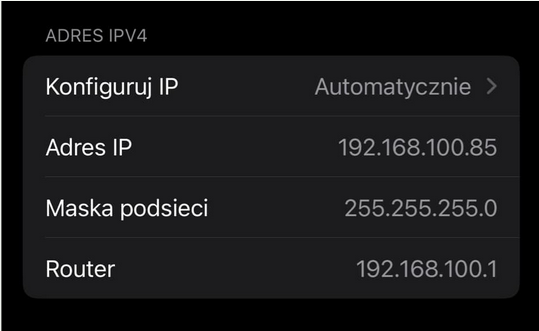

## **Proces konfiguracji AP z użyciem custom hostapd z [repozytorium](https://github.com/vanhoefm/ssid-confusion-hostap/tree/main/hostapd):**

### **Co zostało osiągnięte - skrót:**

1. **Konfiguracja karty sieciowej:**

   * Kluczowe krotki, wyłączenie NetworkManagera, Wprowadzenie karty w tryb AP,
2. **Kompilacja niestandardowej wersji hostapd:**

   * Udało się zbudować hostapd na podstawie niestandardowego pliku konfiguracyjnego `.config` - do głębszej analizy (więcej opisane niżej)
3. **Uruchomienie Access Pointa:**

   * Konfiguracja `hostapd_test.conf`
4. **Konfiguracja i uruchomienie serwera DHCP:**

   * Dla niektórych clientów wymogiem jest otrzymanie adresu IP żeby pozostać w połączeniu
   * Konfiguracja `dnsmasq.conf`
5. **Połączenie clientów i test podatności:**

   * Wariant 1 - Standard attack
   * Wariant 2 - Optimized attack

---

### **Napotkany Problem:**

**Autoryzacja przez RADIUS**:
Mimo wyłączenia wszystkich (przez nas znalezionych) ustawień RADIUS w pliku `.config`, logi jasno wskazują na próbę autoryzacji klienta przy użyciu RADIUS:

**`wlo1: STA 6e:69:91:91:90:fd RADIUS: starting accounting session 18A9B916F883346D`**

**QoL - Skrypty bashowe pomagają w szybszej konfiguracji badania** 🔥:

* [setup_ap.sh](https://drive.google.com/file/d/15FMKWGcLx979fs5PJ-BB_oi0xF8va8OX/view?usp=drive_link)
* [setup_dhcp.sh](https://drive.google.com/file/d/1r8lDpNylK4h0lKeiwcDrpgFBotY3jQj3/view?usp=drive_link)
* [revoke_services.sh](https://drive.google.com/file/d/1llO09_dqio9GamihEuTd5A3k-7ntplFN/view?usp=drive_link)
* Fork [repozytorium](https://github.com/maciej-klimek/ssid-confusion-hostap) z dotychczasowymi postępemi w badaniu.

### **Przebieg Badania Podatności**

1. **Stworzenie serwera DHCP:**

```bash
atis@atis-Latitude-5420:~/Desktop/ssid/ssid-confusion-hostap/hostapd$ sudo ./setup_dhcp.sh
Setting up dnsmasq configuration
dnsmasq configuration written to dnsmasq.conf
Starting dnsmasq with configuration: dnsmasq.conf
dnsmasq: started, version 2.90 cachesize 150
dnsmasq: compile time options: IPv6 GNU-getopt DBus no-UBus i18n IDN DHCP DHCPv6 no-Lua TFTP conntrack ipset no-nftset auth cryptohash DNSSEC loop-detect inotify dumpfile
dnsmasq-dhcp: DHCP, IP range 192.168.100.10 -- 192.168.100.200, lease time 8h
dnsmasq: using nameserver 8.8.8.8#53
dnsmasq: reading /etc/resolv.conf
dnsmasq: using nameserver 8.8.8.8#53
dnsmasq: using nameserver 127.0.0.53#53
dnsmasq: read /etc/hosts - 8 names

dnsmasq-dhcp: DHCPDISCOVER(wlp0s20f3) ce:30:57:8e:78:77
dnsmasq-dhcp: DHCPOFFER(wlp0s20f3) 192.168.100.85 ce:30:57:8e:78:77
dnsmasq-dhcp: DHCPDISCOVER(wlp0s20f3) ce:30:57:8e:78:77
dnsmasq-dhcp: DHCPOFFER(wlp0s20f3) 192.168.100.85 ce:30:57:8e:78:77
dnsmasq-dhcp: DHCPREQUEST(wlp0s20f3) 192.168.100.85 ce:30:57:8e:78:77
dnsmasq-dhcp: DHCPACK(wlp0s20f3) 192.168.100.85 ce:30:57:8e:78:77
```

2. **Konfiguracja AP i Stworzenie *“BaseNet”*** - podłączenie użytkownika do sieci:

```bash
atis@atis-Latitude-5420:~/Desktop/ssid/ssid-confusion-hostap/hostapd$ sudo ./hostapd hostapd_test.conf
wlp0s20f3: interface state UNINITIALIZED->ENABLED
wlp0s20f3: AP-ENABLED
wlp0s20f3: STA ce:30:57:8e:78:77 IEEE 802.11: authenticated
wlp0s20f3: STA ce:30:57:8e:78:77 IEEE 802.11: associated (aid 1)
wlp0s20f3: AP-STA-CONNECTED ce:30:57:8e:78:77
wlp0s20f3: STA ce:30:57:8e:78:77 RADIUS: starting accounting session BAC8A9A46C9E7BFB
```



> Screenshot z urządzenia IOS podłączonego do sieci z przypisanym adresem IP

```bash
dnsmasq-dhcp: DHCPDISCOVER(wlp0s20f3) ce:30:57:8e:78:77
dnsmasq-dhcp: DHCPOFFER(wlp0s20f3) 192.168.100.85 ce:30:57:8e:78:77
dnsmasq-dhcp: DHCPDISCOVER(wlp0s20f3) ce:30:57:8e:78:77
dnsmasq-dhcp: DHCPOFFER(wlp0s20f3) 192.168.100.85 ce:30:57:8e:78:77
dnsmasq-dhcp: DHCPREQUEST(wlp0s20f3) 192.168.100.85 ce:30:57:8e:78:77
dnsmasq-dhcp: DHCPACK(wlp0s20f3) 192.168.100.85 ce:30:57:8e:78:77
```

3. **Podmiana SSID w trakcie kiedy użytkownik jest podłączony do *“BaseNet”*.** `connectedssid -> changedssid`

```bash
atis@atis-Latitude-5420:~/Desktop/ssid/ssid-confusion-hostap/hostapd$ sudo ./hostapd_cli -p wpaspy_ctrl raw "CHANGESSID changedssid"
Selected interface 'wlp0s20f3'
OK
```

4. **Mimo zmiany SSID, klient IOS dalej zostaje połączony do sieci *“BaseNet”*, jedyna zmiana jaką to nową dostępna sieć *“ChangedNet”***

```bash
atis@atis-Latitude-5420:~/Desktop/ssid/ssid-confusion-hostap/hostapd$ ping 192.168.100.85
PING 192.168.100.85 (192.168.100.85) 56(84) bytes of data.
64 bytes from 192.168.100.85: icmp_seq=1 ttl=64 time=18.7 ms
64 bytes from 192.168.100.85: icmp_seq=2 ttl=64 time=2.81 ms
64 bytes from 192.168.100.85: icmp_seq=3 ttl=64 time=85.2 ms
64 bytes from 192.168.100.85: icmp_seq=4 ttl=64 time=86.2 ms
64 bytes from 192.168.100.85: icmp_seq=5 ttl=64 time=109 ms
64 bytes from 192.168.100.85: icmp_seq=6 ttl=64 time=28.9 ms
64 bytes from 192.168.100.85: icmp_seq=7 ttl=64 time=52.6 ms
…
--- 192.168.100.85 ping statistics ---
26 packets transmitted, 26 received, 0% packet loss, time 25038ms
rtt min/avg/max/mdev = 2.365/57.484/109.894/35.192 ms
```

Ponadto klient zachowuje **pełną komunikację z AP** (przykład: ping powyżej)

5. **Wnioski** `-` Klient IOS nie zauważa zmiany SSID - można go uznać za podatnego na zagrożenie SSID Confusion

### **Zestawienie**

Badanie podatności na kliencie **Android 14.0**

1. **Standard Attack:**

   * Po uruchomieniu AP klient otrzymuje probe responsy ***“BaseNet”***, może się z nią połączyć.
   * Przy symulacji ataku (zmianie SSID za pomocą komendy hostapd `FAKESSID`) klient zaczyna otrzymywać “zmienione”  probe responsy - może się połączyć z siecią ***“ChangedNet”***.

   **Wniosek** - nie da się wyciągnąć ponieważ podatność można stwierdzić tylko wtedy kiedy client przeprowadzi procedure *group key handshake* z AP. W naszych testach hostapd dokonywał uwierzytelnienia klienta poprzez RADIUS - nie udało nam się nadpisać tej konfiguracji. Wynik eksperymentu jedynie może sugerować że klient jest podant w kontekście sieci Enterprise. *Temat pozostaje do dalszych badań.*

2. **Optimized Attack**

   * zmiana SSID podczas gdy klient utrzymuje połączenie z *“**BaseNet”***.
     Wynik -   klient zostaje natychmiast **rozłączony** z siecią, po chwili otrzymuje nowe *zmienione* probe responsy od sieci “***ChangedNet”***

   **Wniosek** - klient **nie wykazuje** podatności. Zmiana SSID powoduje natychmiastowe rozłączenie z siecią, możemy więc wnioskować że po stronie klienta występuje ciągłe sprawdzanie SSID w odbieranych ramkach

Badanie podatności na kliencie **IOS 17.6.1** oraz **18.1.1**:

1. **Standard Attack -** Identyczna sytuacja jak w przypadku Android 14.0 - nie można wyciągnąć jednoznacznych wniosków

2. **Optimized Attack**

   * zmiana SSID podczas gdy klient utrzymuje połączenie z *“**BaseNet”***.
     Wynik - klient zostaje **pozostaje podłączony do starej sieci** oraz po krótkiej chwili wykrywa nową sieć “***ChangedNet*** “. Ponadto zachowana jest pełna łączność między klientem a AP (przykład - ping)

   **Wniosek** - klient **wykazuje** podatność. Zmiana SSID nie powoduję rozłączenia clienta od sieci *“**BaseNet”***, zachowuje on pełną komunikację z AP można to udownić za pomocą komendy ping. W chwili zmiany SSID widoczna jest nowa sieć “***ChangedNet*** “ więc możemy wnioskować, że nie występuje ciągłe sprawdzanie SSID w odbieranych ramkach przez klienta.

### **ToDo:**

- [ ] Testy urządzeń android i ios na jednym, identycznie skonfigurowanym hostapd AP - sprawdzenie czy wyniki badań są takie same
- [ ] Dogłębna analiza problemu z autoryzacją przez serwer RADIUS - nasze możliwości ogranicza bardzo uboga i chaotyczna dokumentacja repozytorium ale można podjąć próby dokładniejszego wczytania się w kod/pliki konfiguracyjne
- [ ] Przeanalizować [wpa_supplicant](https://github.com/vanhoefm/ssid-confusion-hostap/tree/main/wpa_supplicant) - Planujemy wykorzystać stworzonego supplicanta do połączenia się z siecią utworzoną za pomocą hostapd, co pozwoli nam rozwiązać problem z Radiusem oraz sprawdzić podatności WPA

tutaj jak sa te bloki output z terminala to mi je zamknij w jeden duzy blok a nie kazda linia jako ` `

NIC INNEGO NIE ZMIENIAJ
