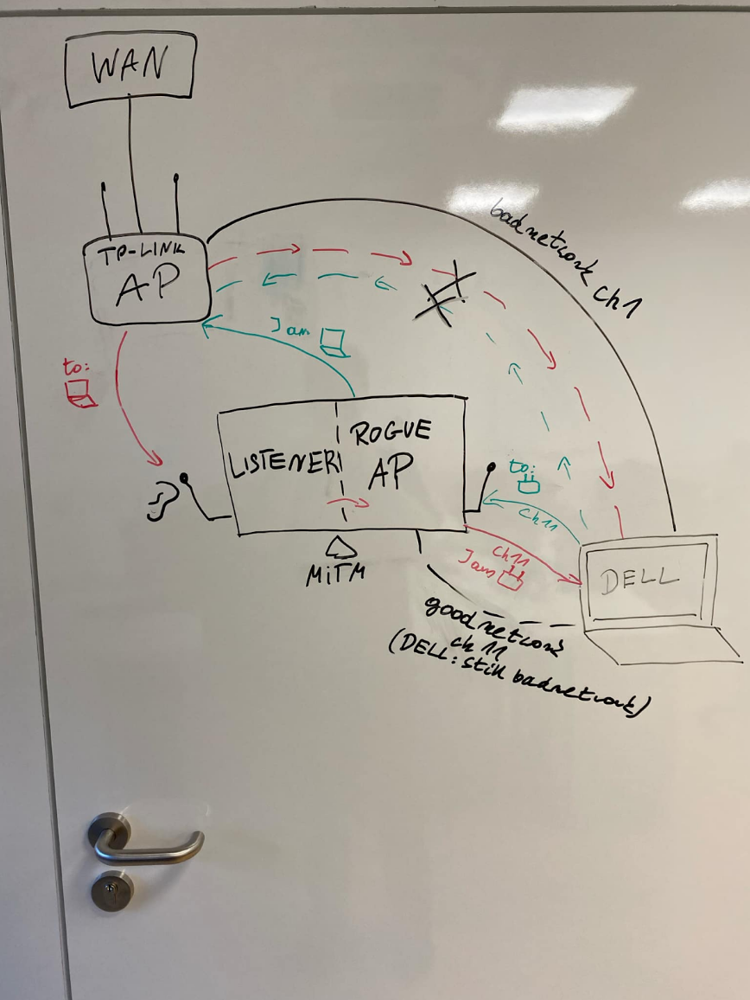

[Repozytory z rzeczywistym atakiem](https://github.com/vanhoefm/ssid-confusion-hostap.git)  
	

# **Instrukcja przeprowadzenia ataku SSID Confusion**

# **Wymagania sprzętowe:**

* 2 komputery z Ubuntu 22.04 \+ router lub 3 komputery z Ubuntu 22.04  
* 3 lub 4 karty WiFi w tym jedna wspierające tryb active monitor (dla atakującego)

## **Setup środowiska:**

### **Komputer 1 lub Router (AP)**

1. Skonfigurować sieć "badnetwork" (kanał 1 lub 11\) z:  
   * WEP \- Podatny  
   * WPA1/2 \- Niepodatny X  
   * WPA3 \- Nieoidatny O  
   * WPA3 SAE-loop \- Podatny  
   * WPA3 SAE-const \- Niepodatny  
   * 802.1X/EAP \- Podatny  
   * AMPE \- Podatny  
   * FT \- Podatny  
   * FILS \- Podatny

### **Komputer 2 (atakujący)**

1. Podłączyć dwie karty WiFi  
2. Sklonować: `git clone https://github.com/vanhoefm/ssid-confusion-hostap.git —recursive`  
3. Przejść do `ssid-confusion-hostap/mc-mitm-ssid/`  
4. Zainstalować zależności z README (punkt 2\) oraz sudo apt-get install iw  
5. Wyłączyć Network Manager  
6. Uruchomić atak:  
   `./mc-mitm.py wlan1(monitor mode) wlan2 badnetwork --target [MAC_OFIARA] --continuous-csa`

### **Komputer 3 (ofiara)**

1. Sprawdzić i zapisać adres MAC  
2. Połączyć się z siecią "badnetwork"

Skrypt automatycznie utworzy kopię "badnetwork" pod nazwą "goodnetwork".

### **Pytania:**

* Dlaczego ofiara dalej jest połączona do “badnetwork”?

### **TO DO:**

* WPA3

