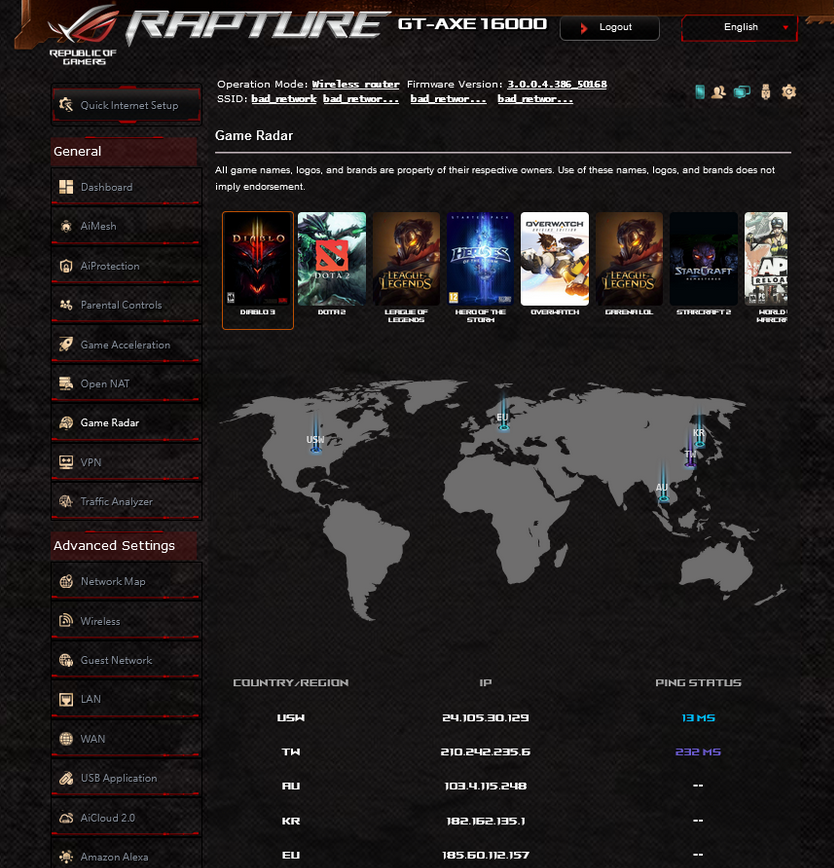
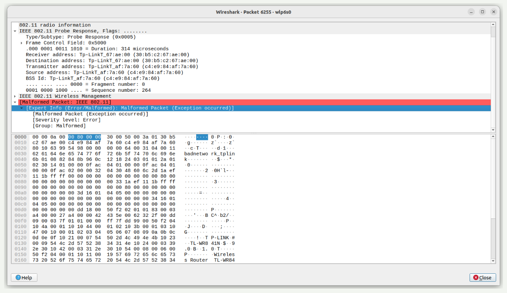
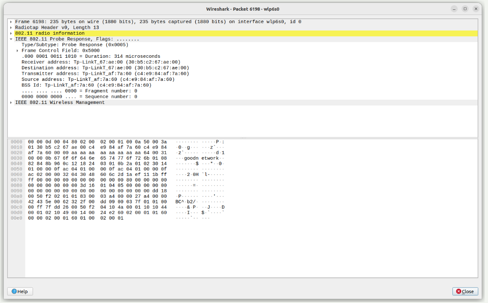

Giga router zero podatności przez software chyba
WPA 3 - personal  okazało sie niepodatne na giga router 
Windows 11 okazał sie podatny
Androdid nie podatny, sam z siebie zrzuca network niezależnie od rodzaju zabezpieczenia
Wpa 2 - personal jest podatne na tplinku
Karty siecowe 5G
Dalesze testy iphone xd
Dokładna analiza ramek w przypadku giga router
Karty w labie są podatne 

