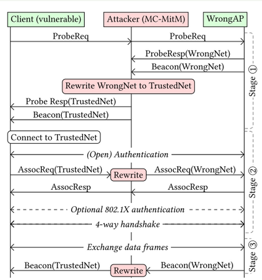
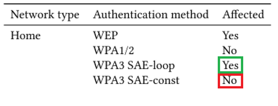
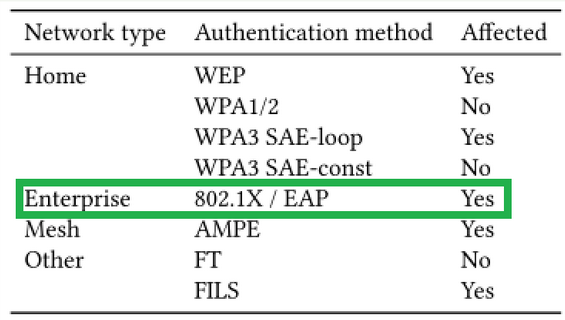

## [Notatki i komentarze do SSID Confusion](https://app.luminpdf.com/viewer/67541f150717db6d69070757)	   	   |		[Notatki i komentarze do Framing Frames](https://app.luminpdf.com/viewer/6753554e48d273cb7a4afaf4)

**Plan działania:**

1. Symulacja przebiegu ataku na podstawie [Repozytorium](https://github.com/vanhoefm/ssid-confusion-hostap/tree/main) w celu sprawdzenia czy nasz hardware (karta sieciowa \+ system operacyjny) jest na niego podatny \- emulacja ataku używając pojedynczej karty sieciowej (np. prosty wifi dongle) z użyciem hostapd 

2. W zależności od przebiegu wcześniejszego testu, chcielibyśmy przeprowadzić atak na rzeczywistym sprzęcie oparty na podstawie [Software do symulacji realnego ataku](https://github.com/vanhoefm/ssid-confusion-hostap/tree/main/mc-mitm-ssid) (jest częścią wcześniejszego repozytorium).

## **Przebieg ataku w oparciu o [SSID Confusion PDF](https://app.luminpdf.com/viewer/67541f150717db6d69070757):**

1. Przechwycić ramkę beacon w celu ustalenia protokołu autoryzacji oraz handshake \- ustalenie algorytmu generującego klucz. 

2. Utworzenie sieci WrongNet  poprawnie autoryzującej takie same credentiale jak TrustedNet (praca sugeruje że znamy hasło do TrustedNet jednak [Artykuł ze strony Mathyego](https://www.mathyvanhoef.com/2024/08/the-ssid-confusion-attack-common.html) stwierdza, że nie jest to potrzebne (patrz Pytanie 2.)).

3. Tworzymy AP na innym kanale niż WrongNet, który będzie używany jako MC-MitM (Multichannel \- Man in the middle) pomiędzy WrongNet a ofiarą.

4. Przechwytujemy probe request ofiary do WrongAP, jeśli zawiera ono SSID TrustedNet to podmieniamy je na WrongNet. Podobnie robimy z probe response z WrongAP tylko WrongNet podmieniamy na TrustedNet

5. Zaczynamy od open authentication które jest przekierowane do WrongAP.

6. Po nim wysyłany jest Association Request, w którym podmieniamy TrustedNet na WrongNet, odpowiadamy Association Response które nie zawiera SSID.

7. Opcjonalnie 802.1X autoryzacja. 

8. Teraz ustanawiamy połączenie za pomocą 4-way-handshake (Opiera się ono na MAC adresie ale w związku z MC-MitM nie jest to problem).

9. To czy uda nam się utrzymać połączenie zależy od protokołu autoryzacji generującego PMK \- który został sprawdzony w 1 punkcie 

   

---

**Pytania:**

1. WPA3 SAE-loop vs SAE-const \- jak jest z implementacją na popularnych AP, czy z perspektywy konfiguracji AP mamy możliwość ten tryb zmieniać  

   

2. Lekka niepewność, czy żeby atak miał szansę zadziałać, RougeAP musi wcześniej znać credentiale z jakimi ofiara loguje się do zaufanej sieci \- z jednej strony (w naszym zrozumieniu) praca sugeruje że tak, jednakowoż Mathy Vanhoefm na [swojej stronie](https://www.mathyvanhoef.com/) pisze *“The adversary doesn't need to know the pre-shared secret.”*

3. Jednym z największych atutów tego typu ataku jest fakt że większośc sieci Enterprise jest na niego potencjalnie podatne:  

   
   
   Nasuwa się więc pytanie czy będzie istniała możliwość żeby właśnie w takim środowisku na uczelni go przetestować \- dostęp do urządzeń w, sali ewentualnie przetestowanie na realnej sieci typu Eduroam na uczelni

